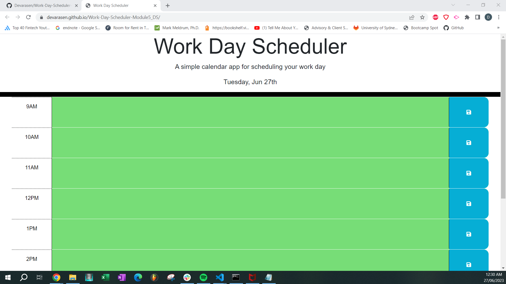

# Work-Day-Scheduler

## Description

This is the module 5 project for the USYD Bootcamp course.

This is a work day scheduler that helps organise daily activities and plans during business hours (9am - 5pm).

The color code on each time block will define if the current task is in the past, present or future.

The color code are as follows:
Past - Gray
Present - Red
Future - Green

Deployed URL: https://github.com/Devarasen/Work-Day-Scheduler-Module5_DS

Repo URL: https://devarasen.github.io/Work-Day-Scheduler-Module5_DS/

## Usage

Multiple time blocks are provided to enter a description of your daily plans.

Once entered, hit the button with the floppy disk image to save your plans to the local storage. You will get a prompt once this is performed.

To clear plans, delete your plan description from before to emply and click the save button again.

Screenshots below will show a brief description of the functionality of this web page.

## Credits

Speacial thanks to my tutors

## License

MIT license